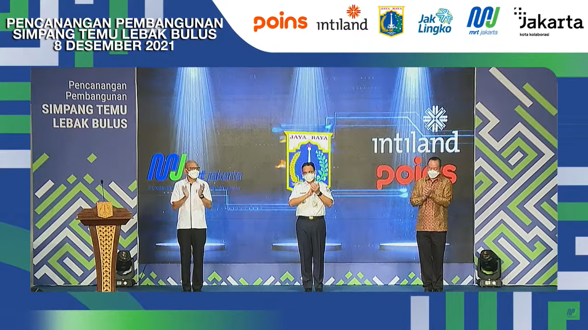

<h1 class="text-white text-2xl font-semibold mt-10 mb-4">Events</h1>

   Acara tersebut dilaksanakan pada hari Selasa Siang dengan dihadiri Gubernur DKI Jakarta, Direktur MRT, dan Direktur Intiland. Di dalam acara tersebut bapak Anies Baswedan berpidato dan dilanjuti penyampaian dari bapak Hans Hutoyo.

<h1 class="mt-8 mb-4"></h1>

<h1 class="mt-8 mb-4"></h1>

Untuk melihat acara sepenuhnya dapat bisa dilihat diklik video dibawah sini.

<iframe width="560" height="315" src="https://www.youtube.com/embed/lkt981pv4mQ" title="YouTube video player" frameborder="0" allow="accelerometer; autoplay; clipboard-write; encrypted-media; gyroscope; picture-in-picture" allowfullscreen></iframe>